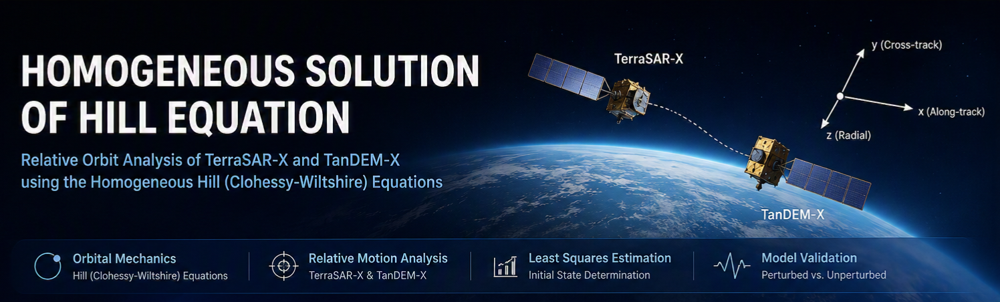
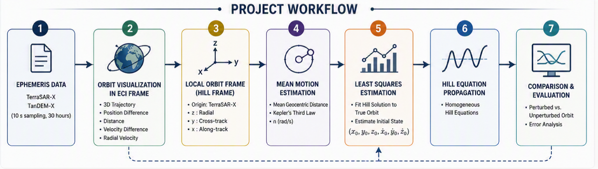
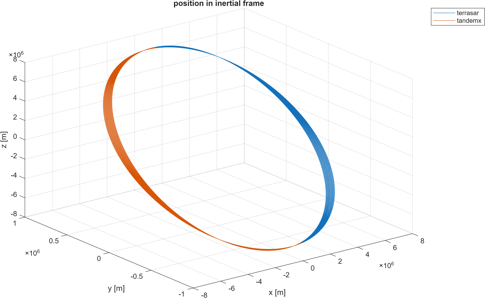
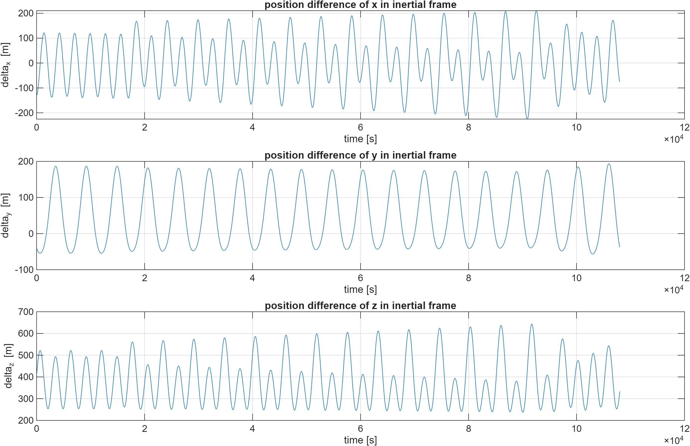
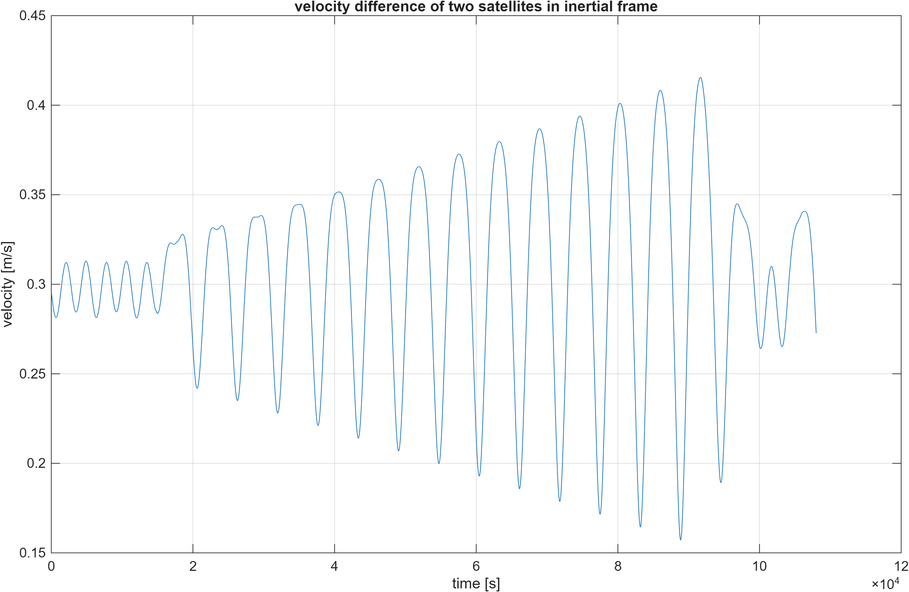
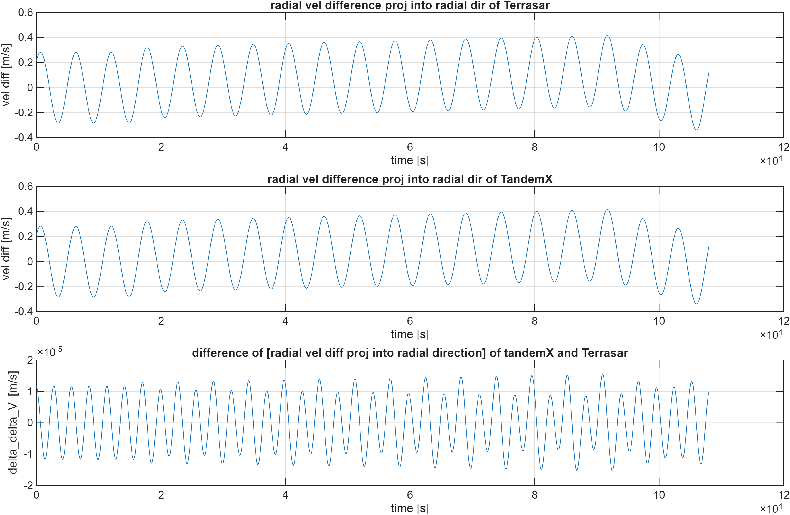
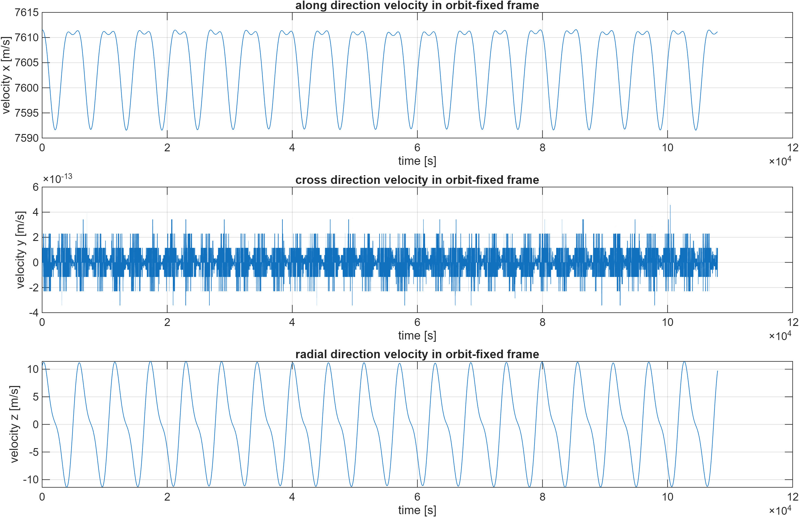
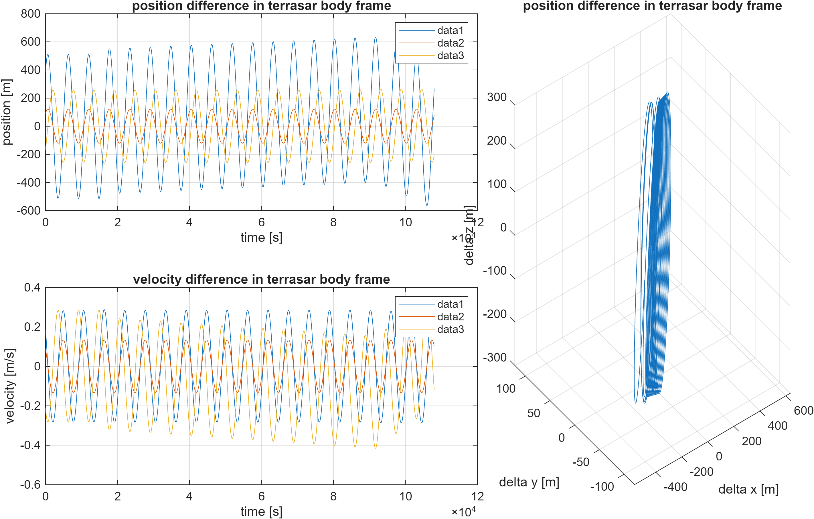
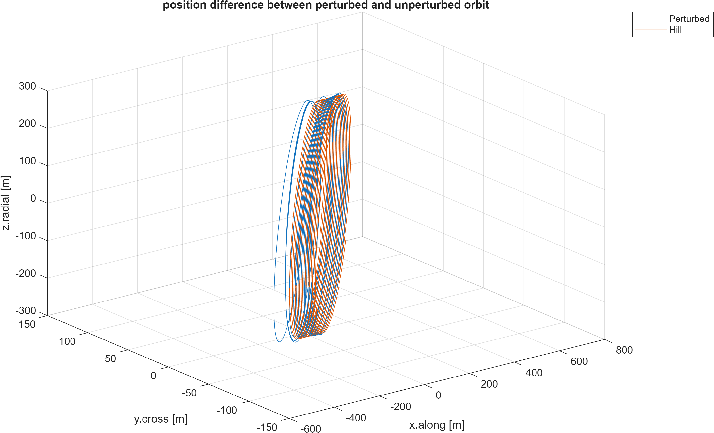
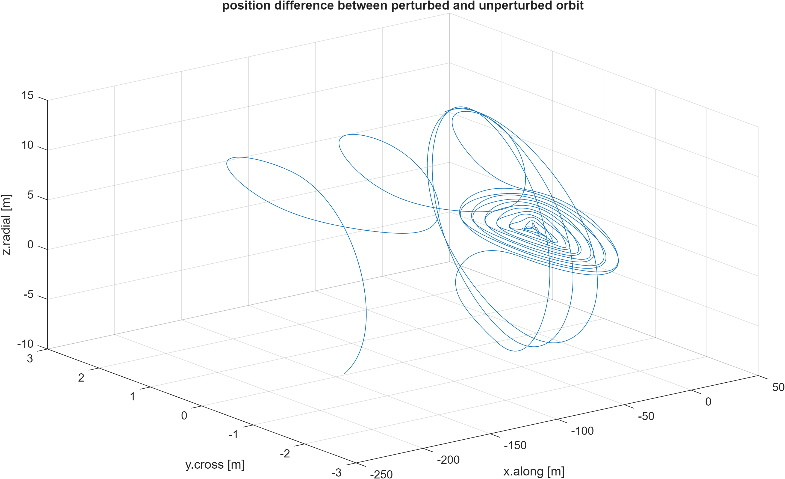

<p align="center">

</p>

<h1 align="center">
🚀 Homogeneous Solution of Hill Equation
</h1>

<p align="center">
Relative Orbit Analysis of TerraSAR-X and TanDEM-X using the Homogeneous Hill (Clohessy-Wiltshire) Equations
</p>

<p align="center">


</p>

---

# 📖 Overview

This project investigates the relative motion between the **TerraSAR-X** and **TanDEM-X** satellites using the **Homogeneous Hill (Clohessy-Wiltshire) Equations**.

Using real satellite ephemeris data, the project compares the numerically integrated orbit with an analytical linearized model. The initial relative state is estimated through **Least Squares adjustment**, and the analytical solution is evaluated against the true orbit.

The implementation was developed in **MATLAB** for the **Advanced Orbital Mechanics** course at the **Technical University of Munich (TUM)**.

---

# ✨ Highlights

- 🛰 Relative orbit analysis of TerraSAR-X & TanDEM-X
- 📐 Construction of the Hill (Orbit-fixed) Reference Frame
- 📈 Mean motion estimation using Kepler's Third Law
- ⚖ Least Squares estimation of initial conditions
- 🚀 Analytical propagation using Homogeneous Hill Equations
- 📊 Numerical vs. analytical orbit comparison

---

# 🛰 Project Workflow

<p align="center">

</p>

---

# 📂 Repository Structure

```text
homogeneous-hill-equation
│
├── README.md
│
├── src
│   ├── main.m
│   ├── task01.m
│   ├── task02.m
│   ├── task03.m
│   ├── task04.m
│   ├── task05.m
│   └── task06.m
│
├── assets
│   ├── banner.png
│   ├── workflow.png
│   ├── orbit_eci.png
│   ├── relative_position.png
│   ├── relative_velocity.png
│   ├── radial_velocity.png
│   ├── hill_frame.png
│   ├── relative_motion_hill_frame.png
│   ├── hill_solution.png
│   └── error.png
│
└── data
    └── README.md
```

---

# ⚙️ Methodology

The project consists of six major steps.

| Step | Description |
|------|-------------|
| Task 1 | Orbit visualization and relative motion analysis |
| Task 2 | Construction of the local Hill reference frame |
| Task 3 | Relative motion analysis in Hill coordinates |
| Task 4 | Mean motion estimation |
| Task 5 | Least Squares estimation of Hill initial conditions |
| Task 6 | Forward propagation using the Hill equations |

---

# 📊 Results

## 1. Orbit in Earth-Centered Inertial (ECI) Frame

<p align="center">

</p>

The inertial trajectories of TerraSAR-X and TanDEM-X almost overlap due to their close formation flight. Their relative separation is several orders of magnitude smaller than the orbital radius.

---

## 2. Relative Position in ECI Frame

<p align="center">

</p>

The relative position components exhibit periodic behavior caused by the satellites' formation geometry and orbital motion.

---

## 3. Relative Velocity

<p align="center">

</p>

The relative velocity remains significantly smaller than the orbital velocity, confirming stable close formation flight.

---

## 4. Radial Velocity

<p align="center">

</p>

The radial velocity oscillates around zero as the satellites periodically move toward and away from each other.

---

## 5. Hill (Orbit-fixed) Reference Frame

<p align="center">

</p>

Transforming the motion into the local Hill frame simplifies interpretation of the relative dynamics by separating the along-track, cross-track, and radial components.

---

## 6. Relative Motion in Hill Frame

<p align="center">

</p>

The bounded three-dimensional trajectory clearly illustrates the formation geometry around TerraSAR-X.

---

## 7. Homogeneous Hill Solution

<p align="center">

</p>

The analytical solution successfully reproduces the primary characteristics of the relative orbit using only six estimated initial parameters.

---

## 8. Analytical Error

<p align="center">

</p>

Small discrepancies remain due to neglected perturbations such as higher-order gravity terms, atmospheric drag, and orbital maneuvers.

---

# 📌 Estimated Parameters

| Parameter | Value |
|-----------|------:|
| Mean Motion | **0.0011 rad/s** |
| Orbital Period | **5689 s** |
| x₀ | **390.12 m** |
| y₀ | **88.59 m** |
| z₀ | **−176.88 m** |
| vx₀ | **0.390 m/s** |
| vy₀ | **0.091 m/s** |
| vz₀ | **0.207 m/s** |

---

# 🛠 Skills Demonstrated

- MATLAB Programming
- Orbital Mechanics
- Satellite Relative Navigation
- Hill (Clohessy-Wiltshire) Equations
- Least Squares Estimation
- Coordinate Transformation
- Scientific Data Visualization
- Numerical Analysis

---

# 🔮 Future Improvements

Potential extensions of this work include

- J2 perturbation modeling
- Non-homogeneous Hill equations
- Relative orbit determination
- Extended Kalman Filter (EKF)
- Autonomous formation flying guidance
- Multi-satellite formation analysis

---

# 📁 Data

The original satellite ephemeris files are **not included** in this repository.

They were distributed exclusively for educational purposes as part of the **Advanced Orbital Mechanics** course at the **Technical University of Munich (TUM)** and are therefore omitted from this repository.

To execute the project, place the following files inside the `data/` directory:

```text
data/
├── terrasar.eph
└── tandemx.eph
```

---

# 📚 References

- W. H. Clohessy and R. S. Wiltshire, *Terminal Guidance System for Satellite Rendezvous*, Journal of the Aerospace Sciences, 1960.
- Howard D. Curtis, *Orbital Mechanics for Engineering Students*.
- Technical University of Munich, **Advanced Orbital Mechanics**.

---

# ⚠ Disclaimer

This repository is a personal implementation developed for educational purposes.

The code has been reorganized, documented, and expanded for portfolio presentation. The original assignment specification, report, and satellite ephemeris data are **not redistributed**.

---

# 👨‍💻 Author

Luke Hyungchan Kim

B.Sc. Aerospace Engineering

Technical University of Munich
